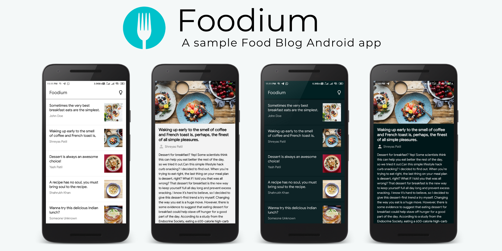

# Foodium 🍲 

[](https://github.com/PatilShreyas/Foodium/actions?query=workflow%3ATest)
[](https://github.com/PatilShreyas/Foodium/actions?query=workflow%3ABuild)
[](https://github.com/PatilShreyas/Foodium/actions?query=workflow%3ALint)

[](LICENSE)
[](http://androidweekly.net/issues/issue-406)
[](https://ktlint.github.io/)


**Foodium** is a sample food blog 🍲 Android application 📱 built to demonstrate use of *Modern Android development* tools. Dedicated to all Android Developers with ❤️. 

***You can Install and test latest Foodium app from below 👇***

[](https://github.com/PatilShreyas/Foodium/releases/latest/download/app.apk)


## About
It simply loads **Posts** data from API and stores it in persistence storage (i.e. SQLite Database). Posts will be always loaded from local database. Remote data (from API) and Local data is always synchronized. 
- This makes it offline capable 😃. 
- Clean and Simple Material UI.
- It supports dark theme too 🌗.

*Dummy API is used in this app. JSON response is statically hosted [here](https://patilshreyas.github.io/DummyFoodiumApi/api/posts/)*.

## Built With 🛠
- [Kotlin](https://kotlinlang.org/) - First class and official programming language for Android development.
- [Coroutines](https://kotlinlang.org/docs/reference/coroutines-overview.html) - For asynchronous and more..
- [Flow](https://kotlin.github.io/kotlinx.coroutines/kotlinx-coroutines-core/kotlinx.coroutines.flow/-flow/) - A cold asynchronous data stream that sequentially emits values and completes normally or with an exception.
- [Android Architecture Components](https://developer.android.com/topic/libraries/architecture) - Collection of libraries that help you design robust, testable, and maintainable apps.
  - [LiveData](https://developer.android.com/topic/libraries/architecture/livedata) - Data objects that notify views when the underlying database changes.
  - [ViewModel](https://developer.android.com/topic/libraries/architecture/viewmodel) - Stores UI-related data that isn't destroyed on UI changes. 
  - [ViewBinding](https://developer.android.com/topic/libraries/view-binding) - Generates a binding class for each XML layout file present in that module and allows you to more easily write code that interacts with views.
  - [Room](https://developer.android.com/topic/libraries/architecture/room) - SQLite object mapping library.
- [Dependency Injection](https://developer.android.com/training/dependency-injection) - 
  - [Hilt-Dagger](https://dagger.dev/hilt/) - Standard library to incorporate Dagger dependency injection into an Android application.
  - [Hilt-ViewModel](https://developer.android.com/training/dependency-injection/hilt-jetpack) - DI for injecting `ViewModel`.
- [Retrofit](https://square.github.io/retrofit/) - A type-safe HTTP client for Android and Java.
- [Moshi](https://github.com/square/moshi) - A modern JSON library for Kotlin and Java.
- [Moshi Converter](https://github.com/square/retrofit/tree/master/retrofit-converters/moshi) - A Converter which uses Moshi for serialization to and from JSON.
- [Coil-kt](https://coil-kt.github.io/coil/) - An image loading library for Android backed by Kotlin Coroutines.
- [Material Components for Android](https://github.com/material-components/material-components-android) - Modular and customizable Material Design UI components for Android.
- [Gradle Kotlin DSL](https://docs.gradle.org/current/userguide/kotlin_dsl.html) - For writing Gradle build scripts using Kotlin.

## Lint ✅
This project uses [***GitHub Super Linter***](https://github.com/github/super-linter) which is Combination of multiple linters to install as a GitHub Action.

Following Linters are used internally by super linter (enabled for this project):
- XML: [LibXML](http://xmlsoft.org/)
- Kotlin: [ktlint](https://github.com/pinterest/ktlint)


## [`Dagger`](https://dagger.dev/) (Old) DI Version 🗡️
If you want to refer old way of Dependency Injetion using Dagger2, see branch [***`dagger2-di`***](https://github.com/PatilShreyas/Foodium/tree/dagger2-di)

[](https://github.com/PatilShreyas/Foodium/tree/dev-hilt-android)


## [`Koin`](https://insert-koin.io/) DI Version 🗡️
If you want to use *Koin - Dependency Injection framework* in app then visit below repository.

[](https://github.com/pranaypatel512/Foodium)

**Contributed By:** [Pranay Patel](https://github.com/pranaypatel512/)


# Package Structure
    
    dev.shreyaspatil.foodium    # Root Package
    .
    ├── data                # 用于数据处理.
    │   ├── local           # 本地持久性数据库。（SQLite）数据库
    |   │   ├── dao         # 数据库数据访问对象   
    │   ├── remote          # 远程数据处理程序    
    |   │   ├── api         # 远程端点的改造api.
    │   └── repository      # 单一数据源.
    |
    ├── model               # 模型类
    |
    ├── di                  # 依赖注入            
    │   ├── builder         # 活动生成器
    │   ├── component       # DI组件      
    │   └── module          # DI模块
    |
    ├── ui                  # 活动/视图层
    │   ├── base            # 基本视图
    │   ├── main            # 主屏幕活动和视图模型
    |   │   ├── adapter     # 用于RecyclerView的适配器
    |   │   └── viewmodel   # 回收站视图的ViewHolder
    │   └── details         # 详细屏幕活动和ViewModel
    |
    └── utils               # 实用程序类/Kotlin扩展


## Architecture
This app uses [***MVVM (Model View View-Model)***](https://developer.android.com/jetpack/docs/guide#recommended-app-arch) architecture.


## Contribute
If you want to contribute to this library, you're always welcome!
See [Contributing Guidelines](CONTRIBUTING.md). 

## Discuss 💬

Have any questions, doubts or want to present your opinions, views? You're always welcome. You can [start discussions](https://github.com/PatilShreyas/Foodium/discussions).

## Contact
If you need any help, you can connect with me.

Visit:- [shreyaspatil.dev](https://shreyaspatil.dev)

## License
```
MIT License

Copyright (c) 2020 Shreyas Patil

Permission is hereby granted, free of charge, to any person obtaining a copy
of this software and associated documentation files (the "Software"), to deal
in the Software without restriction, including without limitation the rights
to use, copy, modify, merge, publish, distribute, sublicense, and/or sell
copies of the Software, and to permit persons to whom the Software is
furnished to do so, subject to the following conditions:

The above copyright notice and this permission notice shall be included in all
copies or substantial portions of the Software.

THE SOFTWARE IS PROVIDED "AS IS", WITHOUT WARRANTY OF ANY KIND, EXPRESS OR
IMPLIED, INCLUDING BUT NOT LIMITED TO THE WARRANTIES OF MERCHANTABILITY,
FITNESS FOR A PARTICULAR PURPOSE AND NONINFRINGEMENT. IN NO EVENT SHALL THE
AUTHORS OR COPYRIGHT HOLDERS BE LIABLE FOR ANY CLAIM, DAMAGES OR OTHER
LIABILITY, WHETHER IN AN ACTION OF CONTRACT, TORT OR OTHERWISE, ARISING FROM,
OUT OF OR IN CONNECTION WITH THE SOFTWARE OR THE USE OR OTHER DEALINGS IN THE
SOFTWARE.
```
